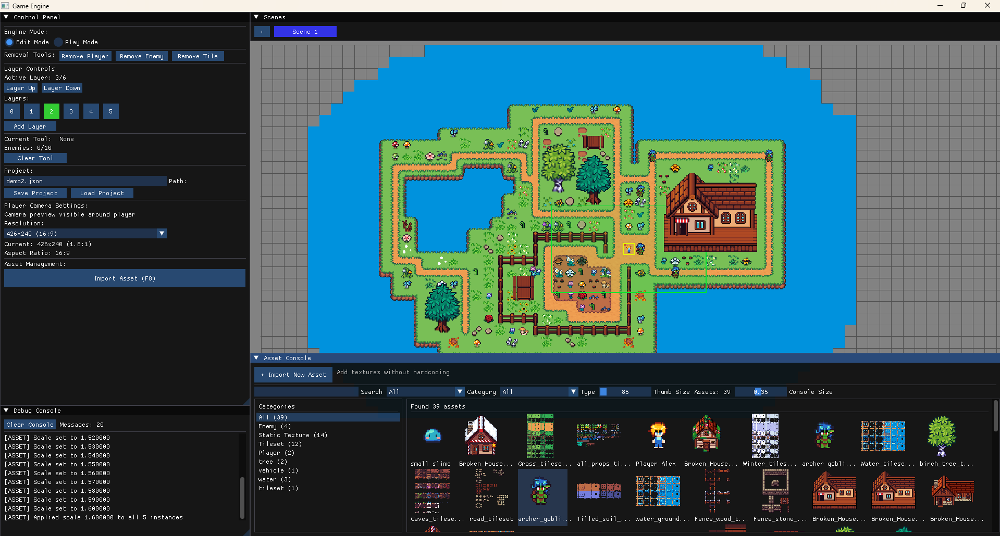
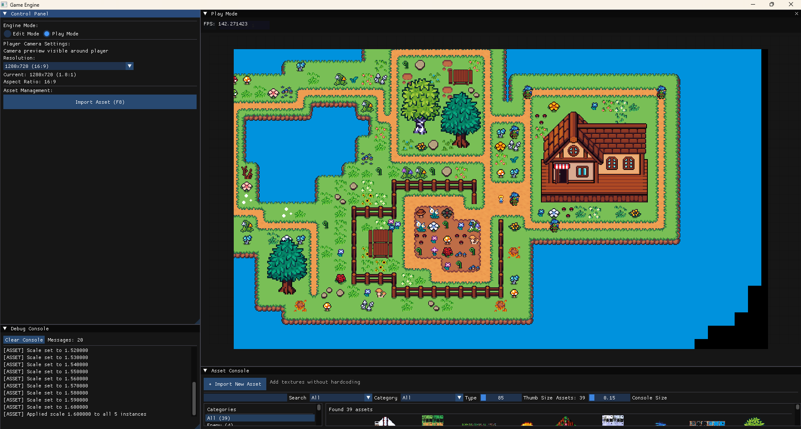

# 🎮 Click-Craft Creator

**Click-Craft Creator** is a modular, 2D game engine built in C++ designed specifically to empower children to create their own games without writing a single line of code.

By combining an intuitive drag-and-drop interface with a robust underlying architecture, Click-Craft Creator bridges the gap between imagination and playable reality. Draw your maps, import your characters, animate them, and hit play—all in real-time.

### 🛠️ The Level Editor (Edit Mode)
Design your world using intuitive tools, multi-layered tile maps, and a dynamic asset placement system.

### ▶️ Real-Time Testing (Play Mode)
Hit play to instantly test your game. The engine's snapshot system ensures that any chaos caused during testing is completely reverted the moment you return to the editor.

---

## ✨ Key Features

### 🛠️ Dual-Mode Architecture
* **Edit Mode**: A fully-featured level editor with layered tile placement, entity management, and bulk-editing tools.
* **Play Mode (Snapshot System)**: Instantly test your game. The engine creates temporary "snapshots" of your level, meaning any destruction, movement, or chaos that happens during testing is instantly reverted the moment you switch back to Edit Mode.

### 🗺️ Advanced TileMap System
* **Sparse Matrix Grid**: Highly optimized `std::unordered_map` utilizing 64-bit coordinate packing.
* **Multi-Layered**: Support for up to 20 rendering layers with individual visibility toggles.
* **Smart Tools**: Includes a bulk-collision editor to quickly paint walkable and blocked areas.

### 👾 Dynamic Entities & Animation
* **Unified Entities**: Place Players, chasing Enemies, and Static props directly onto the grid.
* **Visual Animation Editor**: Import spritesheets and define animations (Idle, Walk, Attack) with real-time previews. Supports directional logic (Up, Down, Left, Right) and custom frame rates.
* **Dynamic Scaling**: Scale props from `0.25x` to `4.0x` while maintaining perfect grid centering and collision boundaries.

### 📦 Smart Asset Pipeline
* **No Hardcoding**: Dynamically scan your folders for `.png` files using the built-in ImGui Asset Importer.
* **Auto-Slicing**: The engine automatically detects and slices Tilesets and Spritesheets using Smart Defaults.
* **Persistent Definitions**: Asset paths, frame selections, and animation configurations are automatically serialized to `assets.json` so your workspace is always exactly how you left it.

---

## 💻 Technical Stack

Click-Craft Creator is built with performance and modularity in mind:
* **Language**: C++20
* **Graphics/Audio Framework**: [raylib](https://www.raylib.com/) (Pixel-perfect point filtering)
* **GUI**: [Dear ImGui](https://github.com/ocornut/imgui) via [rlImGui](https://github.com/raylib-extras/rlImGui)
* **Serialization**: [nlohmann/json](https://github.com/nlohmann/json) (v1.2)
* **Build System**: CMake

---

## 🚀 Getting Started

### Prerequisites
* A C++20 compatible compiler (MSVC, GCC, or Clang)
* CMake (3.15+)
* *Dependencies (raylib, ImGui, nlohmann/json) are handled via your specific build environment (e.g., vcpkg or submodules).*

### Running the Engine
1. Clone the repository.
2. Build the project using CMake.
3. Run the `2D_GameEngine` executable.
4. Use the **Asset Console** to import your first `.png`, set it as a Player, and click **Use Asset** to place them in the world!

---

## Development Roadmap

We are currently working towards a 1-month milestone to finalize the creator experience:
- [ ] **Interactive Tutorial**: A child-friendly, ImGui-based guided walkthrough of the engine's tools.
- [ ] **Localization (LanguageManager)**: Full UI toggling between English and Slovak.
- [ ] **Animated Tiles**: Global timed logic for environmental hazards and water tiles.
- [ ] **Multi-Scene Polish**: Finalizing Scene Switchers, advanced Chase AI, and a playable demo project.
